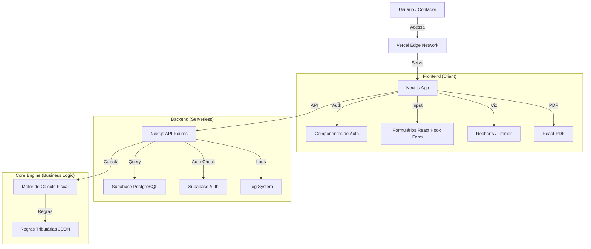

# Arquitetura Técnica

## 🏗️ Visão Geral

FiscalOS é construído sobre uma arquitetura **Serverless** moderna, focada em baixo custo, escalabilidade automática e facilidade de manutenção.

Utilizamos o padrão **T3 Stack** (modificado para Supabase) para garantir tipagem forte (TypeScript) do banco de dados ao frontend.

---

## 🧩 Diagrama de Arquitetura

---

## 🛠️ Stack Tecnológica Detalhada

### 1. Frontend
- **Framework:** [Next.js 14+](https://nextjs.org/) (App Router)
- **Linguagem:** TypeScript
- **Estilização:** [Tailwind CSS](https://tailwindcss.com/) + [shadcn/ui](https://ui.shadcn.com/) (componentes acessíveis e bonitos)
- **Gerenciamento de Estado:** React Server Components + Context API (para estado global simples)
- **Formulários:** React Hook Form + Zod (validação)
- **Visualização:** Recharts ou Tremor (para gráficos financeiros)
- **Geração de PDF:** @react-pdf/renderer (geração client-side ou server-side)

### 2. Backend & Dados
- **Plataforma:** [Supabase](https://supabase.com/)
- **Banco de Dados:** PostgreSQL
- **Autenticação:** Supabase Auth (Email/Senha + Google/Magic Link)
- **ORM:** Prisma ou Drizzle (para type-safety com o banco)
- **API:** Next.js Server Actions (para chamadas diretas e seguras)

### 3. Infraestrutura & DevOps
- **Hosting:** [Vercel](https://vercel.com/) (Hospedagem gratuita para hobby/startups)
- **CI/CD:** GitHub Actions (ou o próprio pipeline da Vercel)
- **Monitoramento:** Vercel Analytics / Sentry (para erros)

### 4. Pagamentos
- **Gateway:** [Stripe](https://stripe.com/)
- **Gestão de Assinaturas:** Stripe Customer Portal

---

## 💾 Modelagem de Dados (Draft)

### Tabela `users` (Contadores)
- `id`: UUID (PK)
- `email`: String (Unique)
- `name`: String
- `plan_tier`: Enum (FREE, PRO, AGENCY)
- `created_at`: Timestamp

### Tabela `clients` (Empresas do Contador)
- `id`: UUID (PK)
- `user_id`: UUID (FK -> users)
- `cnpj`: String
- `company_name`: String
- `cnae_main`: String (Código de atividade)
- `employees_count`: Integer
- `revenue_last_12m`: Decimal
- `payroll_last_12m`: Decimal

### Tabela `simulations` (Planejamentos)
- `id`: UUID (PK)
- `client_id`: UUID (FK -> clients)
- `created_at`: Timestamp
- `input_data`: JSONB (Snapshot dos dados usados)
- `result_data`: JSONB (Resultado dos cálculos)
- `selected_regime`: String (Regime recomendado)

---

## 🔒 Segurança

- **RLS (Row Level Security):** Configurado no Supabase para garantir que um contador *nunca* acesse dados de clientes de outro contador.
- **Validação de Dados:** Zod schemas em todas as entradas da API.
- **Criptografia:** Dados sensíveis em repouso e em trânsito (HTTPS/SSL).

---

## ⚡ Performance

- **Edge Caching:** Uso agressivo de cache da Vercel para páginas estáticas (Marketing).
- **Server Components:** Redução de JavaScript enviado ao cliente.
- **Otimização de Imagens:** Next/Image.

---

## 💰 Estimativa de Custos (Inicial)

| Serviço | Tier | Custo |
|---------|------|-------|
| Vercel | Hobby | $0/mês |
| Supabase | Free | $0/mês |
| GitHub | Free | $0/mês |
| Stripe | Pay-as-you-go | ~2.9% por transação |
| Domínio | .com.br | ~R$ 40/ano |

**Custo fixo mensal inicial: R$ 0,00**
