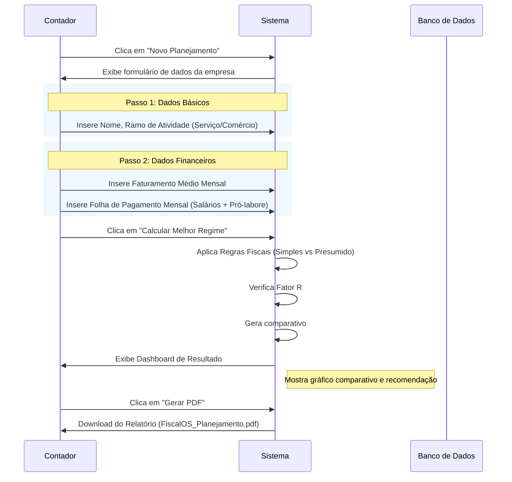

# Fluxos de Usuário (User Flows)

## 🔄 Fluxo Principal: Novo Planejamento

## 🔐 Fluxo de Autenticação

1. **Visitante** acessa a home.
2. Clica em "Entrar" ou "Começar Agora".
3. **Login:** Email/Senha ou Google.
4. **Onboarding (Primeiro Acesso):**
   - Pergunta nome do escritório contábil.
   - Configura logo (opcional).
5. Redireciona para Dashboard.

## 👥 Fluxo de Gestão de Clientes

1. **Dashboard:** Lista todos os clientes cadastrados.
2. **Adicionar:** Botão flutuante "+" -> Modal de cadastro rápido.
3. **Editar:** Clica no cliente -> Altera faturamento/folha (dados mudam com o tempo).
4. **Histórico:** Ao clicar no cliente, vê planejamentos passados (V2).

## ⚠️ Pontos de Atenção (Edge Cases)

- **Faturamento Zero:** Se usuário colocar R$ 0,00, sistema deve alertar ou tratar como empresa inativa.
- **Fator R no Limite:** Se Fator R der 27,9%, sistema deve exibir ALERTA VISUAL forte sugerindo aumento de pró-labore.
- **Regime Proibido:** Algumas atividades não podem ser Simples Nacional (V2: Validação por CNAE). No MVP, assumimos que o contador sabe se pode ou não, o sistema apenas calcula os valores.
